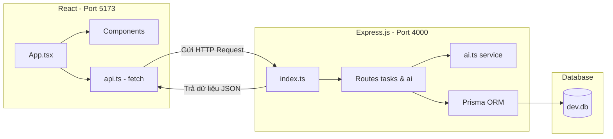

# HƯỚNG DẪN CẤU TRÚC VÀ QUY TRÌNH CODE - TASKAI

Tài liệu này dành cho người mới bắt đầu làm quen với các framework hiện đại, giúp bạn hiểu rõ cách thức hoạt động và luồng chạy của ứng dụng **TaskAI**.

---

## 1. Kiến trúc Tổng quan (Full-Stack Architecture)

Dự án được thiết kế theo mô hình **Client - Server (Frontend & Backend tách biệt)**:

* **Frontend (Client)**: Chạy ở cổng `5173`, xây dựng bằng **React**, **Vite** và **Tailwind CSS**. Có nhiệm vụ hiển thị giao diện và nhận tương tác từ người dùng.
* **Backend (Server)**: Chạy ở cổng `4000`, xây dựng bằng **Node.js** và **Express.js**. Chứa các đường dẫn (endpoints) API để kết nối trực tiếp với Database và gọi API trí tuệ nhân tạo (Claude AI).
* **Database (Cơ sở dữ liệu)**: Sử dụng hệ quản trị cơ sở dữ liệu siêu nhẹ **SQLite** (lưu dưới dạng tệp tin `dev.db` nội bộ) và kết nối thông qua **Prisma ORM**.

---

## 2. Cơ sở dữ liệu (Database Schema)

Thay vì viết câu lệnh SQL phức tạp để tạo bảng, dự án sử dụng **Prisma ORM**. Cấu trúc bảng được định nghĩa trong tệp `backend/prisma/schema.prisma`:

* **Bảng `Task` (Lưu công việc)**:
  * `id`: Chuỗi ký tự ngẫu nhiên duy nhất (UUID) để phân biệt các công việc.
  * `title`: Tiêu đề việc cần làm.
  * `category`: Phân loại gồm `'work'` (công việc), `'personal'` (cá nhân), `'urgent'` (khẩn cấp).
  * `priority`: Độ ưu tiên gồm `'low'` (thấp), `'medium'` (trung bình), `'high'` (cao).
  * `deadline`: Ngày giờ hết hạn (hoặc `null` nếu không thiết lập).
  * `completed`: Trạng thái đã xong (`true`) hay chưa (`false`).
* **Bảng `ChatMessage` (Lưu lịch sử chat với AI)**:
  * `id`: Mã tin nhắn.
  * `role`: `'user'` (người dùng gõ) hoặc `'assistant'` (AI trả lời).
  * `content`: Nội dung tin nhắn.

---

## 3. Quy trình chạy của API Backend (Express.js)

Tệp chạy chính của Backend là `backend/src/index.ts`. Nó khởi tạo Server Express, sau đó định tuyến (routing) các URL từ Frontend gửi đến:

### Thao tác Cơ bản (CRUD) - `backend/src/routes/tasks.ts`
Khi Frontend muốn làm gì với Task, nó sẽ gửi một yêu cầu HTTP (HTTP Request) đến các URL tương ứng:
* **Lấy danh sách task (`GET /api/tasks`)**: Backend dùng lệnh `prisma.task.findMany()` để truy vấn cơ sở dữ liệu và gửi trả về mảng danh sách công việc.
* **Thêm mới task (`POST /api/tasks`)**: Nhận dữ liệu từ Frontend gửi lên qua phần thân tin nhắn (`req.body`), dùng lệnh `prisma.task.create()` để thêm vào database.
* **Sửa task (`PUT /api/tasks/:id`)**: Nhận `id` từ thanh địa chỉ và các trường cần sửa từ `req.body`, dùng lệnh `prisma.task.update()`.
* **Xóa task (`DELETE /api/tasks/:id`)**: Dùng lệnh `prisma.task.delete()`.

---

## 4. Giao diện Frontend hoạt động như thế nào? (React.js)

React quản lý giao diện dựa trên **State (Trạng thái)** và **Component (Thành phần giao diện tái sử dụng)**.

### Trạng thái (State) và Vòng đời (useEffect)
Trong tệp `frontend/src/App.tsx`:
1. **Khai báo State**: `const [tasks, setTasks] = useState([])`
   * `tasks` chứa danh sách hiển thị hiện tại.
   * `setTasks` là hàm duy nhất dùng để thay đổi danh sách đó. Khi gọi `setTasks(danh_sách_mới)`, React phát hiện sự thay đổi và vẽ lại giao diện trên trình duyệt.
2. **Kích hoạt tự động (`useEffect`)**:
   * Khi mở trang web, hàm `useEffect` được gọi tự động. Nó kích hoạt hàm `loadTasks()` để gọi hàm `api.getTasks()` (định nghĩa trong `frontend/src/api.ts`).
   * Khi dữ liệu trả về từ backend, gọi `setTasks(data)` để vẽ danh sách công việc lên màn hình.

### Các thành phần con (Components)
Để code không bị quá dài, giao diện được chia nhỏ thành các tệp tin trong thư mục `frontend/src/components/`:
* `Sidebar.tsx`: Chứa bộ lọc danh mục/độ ưu tiên và nút Tóm tắt ngày.
* `TaskCard.tsx`: Thẻ hiển thị cho từng công việc cụ thể.
* `TaskForm.tsx`: Khung nhập liệu khi thêm/sửa task.
* `ChatPanel.tsx`: Hộp thoại trò chuyện với AI.
* `SummaryModal.tsx`: Hộp thoại báo cáo tổng hợp.

---

## 5. Quy trình xử lý thông minh của AI (Claude API)

Luồng hoạt động của tính năng AI được định nghĩa trong `backend/src/services/ai.ts` và tích hợp vào 3 tính năng chính:

### A. Gợi ý Tự động (Auto-Suggest & Classify)
* **Luồng chạy**: Người dùng nhập *"Họp dự án quan trọng ngày mai lúc 9h sáng"* -> Click nút **Gợi ý AI**.
* **Xử lý**: 
  1. Frontend gửi yêu cầu đến `POST /api/ai/suggest` kèm theo tiêu đề.
  2. Backend nhận tiêu đề, gửi cho Claude API kèm theo một mẫu hướng dẫn (Prompt).
  3. Claude phân tích từ ngữ: *"Họp"* thuộc về `work`, *"quan trọng"* thuộc về độ ưu tiên `high`, và *"ngày mai lúc 9h"* được đổi thành chuỗi ngày ISO cụ thể.
  4. Trả kết quả JSON về -> Frontend tự động điền các trường này vào form mà không cần người dùng nhập tay.

### B. Trò chuyện tạo/quản lý Task (Chatbot Agent)
* **Luồng chạy**: Người dùng mở khung Chat, gõ *"Thêm task Đi siêu thị mua sữa tối nay"*.
* **Xử lý**:
  1. Frontend gửi tin nhắn lên `POST /api/ai/chat`.
  2. Tin nhắn được lưu vào cơ sở dữ liệu `ChatMessage` để lưu lịch sử.
  3. Backend truyền toàn bộ lịch sử 15 tin nhắn gần nhất và **danh sách công việc hiện có** cho Claude API.
  4. Claude API phân tích yêu cầu. Nó nhận diện được hành động mong muốn của người dùng và trả về kết quả kèm theo thẻ hành động:
     `<actions>[{"type": "CREATE_TASK", "payload": {"title": "Đi siêu thị mua sữa", "category": "personal", ...}}]</actions>`
  5. Backend quét nội dung tin nhắn, bóc tách thẻ `<actions>` này ra, **thực hiện trực tiếp lệnh INSERT/UPDATE/DELETE** vào SQLite database bằng Prisma Client.
  6. Sau đó trả lại phản hồi dạng text của AI kèm theo danh sách công việc đã cập nhật cho Frontend làm mới giao diện ngay lập tức.

### C. Tóm tắt ngày (Daily Summary)
* **Luồng chạy**: Người dùng bấm **Tóm tắt ngày với AI**.
* **Xử lý**:
  1. Gửi yêu cầu đến `GET /api/ai/summary`.
  2. Backend lấy toàn bộ danh sách công việc hiện có (bao gồm việc đã xong và chưa xong) gửi cho Claude API.
  3. Claude đóng vai trò là một chuyên gia năng suất, viết một bản báo cáo ngắn gọn dạng Markdown (có số liệu tổng kết, lời khuyên và các việc cần ưu tiên).
  4. Frontend nhận chuỗi Markdown, tự động dịch các cú pháp Markdown thành các tiêu đề và danh sách đẹp mắt trên Popup hiển thị.
