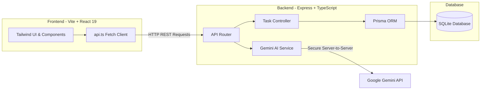

# 📝 TaskAI - Smart Todo List & AI Productivity Assistant

<div align="center">


<p align="center">
  A modern, full-stack task management application powered by <b>Google Gemini AI</b> to automate task breakdown, intelligent categorization, and productivity planning.
</p>

</div>

---

## 🌟 Overview

**TaskAI** is designed to solve a common productivity bottleneck: people often struggle to break broad, overwhelming goals into concrete, actionable steps. By integrating **Generative AI** directly into a full-stack task workflow, TaskAI helps users decompose complex work, predict deadlines, automatically assign priorities, and interact with a contextual AI assistant for real-time planning.

---

## 🚀 Key Features

- **📋 Intuitive Task Management**:
  - Full CRUD operations with instant UI updates.
  - Priority levels (`Low`, `Medium`, `High`) and categorization (`Work`, `Personal`, `Urgent`).
  - Due dates, completion toggles, and status filtering.
- **🤖 AI-Powered Auto-Suggest & Classification**:
  - Automatically parses free-form natural language (e.g. *"Prepare quarterly financial slides before Friday 3 PM"*).
  - Infers appropriate category, priority, and deadline automatically using **Google Gemini**.
- **💬 Conversational AI Assistant**:
  - Built-in chat panel to interactively manage tasks, plan daily schedules, or brainstorm sub-tasks.
- **📊 Daily Productivity Summary**:
  - Generates comprehensive summaries of completed milestones vs. pending obligations with a single click.
- **🔒 Enterprise-Grade Security Architecture**:
  - AI API keys are strictly secured server-side in the backend environment. No sensitive secrets are ever exposed to the client-side bundle.
- **🎨 Modern & Responsive Design**:
  - Built with React 19, Vite, Tailwind CSS 4, and Lucide Icons.

---

## 🏗️ Architecture & Tech Stack



### 💻 Technologies Used
- **Frontend**: React 19, TypeScript, Vite, Tailwind CSS 4, Lucide React.
- **Backend**: Node.js, Express.js, TypeScript, Nodemon.
- **Database & ORM**: SQLite, Prisma ORM.
- **AI Integration**: Google Gemini API (`@google/generative-ai`), Fallback heuristic engine.

---

## 📂 Project Structure

```text
todo-list-and-AI/
├── backend/                  # Express REST API Server
│   ├── prisma/               # Prisma database schema & migrations
│   ├── src/
│   │   ├── routes/           # REST endpoints (/api/tasks, /api/ai)
│   │   ├── services/         # Gemini AI integration service
│   │   └── index.ts          # Server entry point
│   ├── .env.example          # Environment variables template
│   ├── package.json
│   └── tsconfig.json
├── frontend/                 # React 19 + Vite Frontend Application
│   ├── src/
│   │   ├── components/       # TaskCard, TaskForm, ChatPanel, Sidebar, etc.
│   │   ├── api.ts            # Type-safe API client
│   │   ├── App.tsx           # Main application state & layout
│   │   └── main.tsx
│   ├── package.json
│   └── vite.config.ts
├── chay-backend.bat          # 1-Click backend runner (Windows)
├── chay-frontend.bat         # 1-Click frontend runner (Windows)
├── khoi-tao.bat              # 1-Click setup script (Windows)
└── README.md
```

---

## 🛠️ Getting Started

### Prerequisites
- [Node.js](https://nodejs.org/) (v18.0 or higher)
- npm or yarn

### 1. Clone Repository
```bash
git clone https://github.com/IamHarzod/todo-list-and-AI.git
cd todo-list-and-AI
```

### 2. Environment Configuration
Create a `.env` file in the `backend/` directory:
```bash
cd backend
cp .env.example .env
```
Open `backend/.env` and insert your [Google Gemini API Key](https://aistudio.google.com/):
```env
PORT=4000
DATABASE_URL="file:./dev.db"
GEMINI_API_KEY="your_gemini_api_key_here"
```
*(Note: If no API key is provided, the application will automatically fall back to an internal heuristic parser without crashing).*

---

### 3. Run the Application

#### Option A: Quick Launch (Windows 1-Click)
1. Double-click `khoi-tao.bat` to install all dependencies and run database migrations.
2. Double-click `chay-backend.bat` (Backend runs on `http://localhost:4000`).
3. Double-click `chay-frontend.bat` (Frontend runs on `http://localhost:5173`).

#### Option B: Manual Setup

**Backend:**
```bash
cd backend
npm install
npx prisma migrate dev --name init
npm run dev
```

**Frontend:**
```bash
cd ../frontend
npm install
npm run dev
```

Visit `http://localhost:5173` in your browser to start using the app!

---

## 📸 Screenshots

*(Add screenshots of your Dashboard and AI Chat Assistant here)*

| Task Management Dashboard | AI Assistant & Planning |
| :---: | :---: |
|  | *(Paste chat screenshot here)* |

---

## 💡 Technical Highlights for Interviewers

- **Zero-Exposure Security**: Unlike client-side AI implementations where keys are exposed in network requests, all Gemini API calls are strictly mediated by the Express backend.
- **Robust Structured Output Parsing**: Implemented defensive JSON extraction and schema validation to handle non-deterministic LLM responses gracefully without frontend crashes.
- **Graceful Degradation**: Designed with a rule-based fallback mechanism, ensuring the system remains functional even if AI rate limits or network errors occur.
- **Modern Full-Stack Separation**: Clean separation of concerns between presentation (React 19), business logic (Express router/service layer), and data persistence (Prisma ORM).

---

## 📄 License
This project is open-source under the [MIT License](LICENSE).